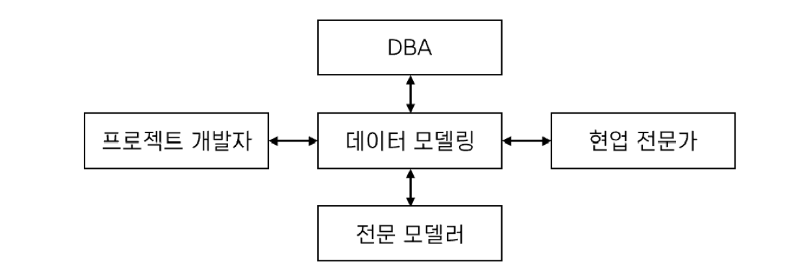
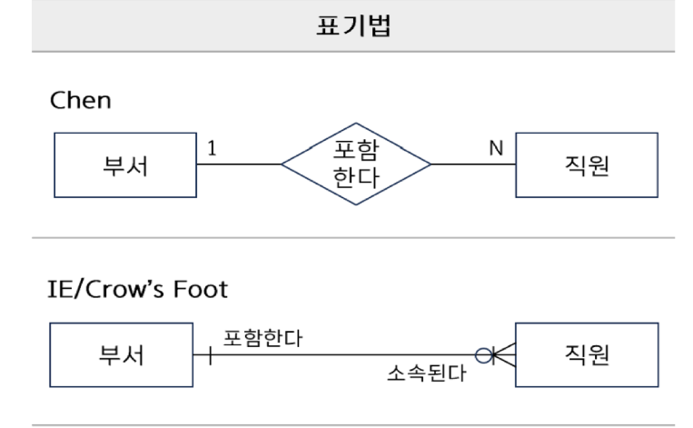

# 데이터 모델링의 이해 

# 1절 데이터 모델의 이해

## 1. 모델링
- 복잡한 현실세계 -> 추상화, 단순화하여 일정한 표기법(형식)에 의해 명시적으로 표현하는 것.
- 데이터베이스를 구축하기 위한 분석, 설계의 과정
- 정보 시스템을 구축하기 위한 데이터 관점의 업무 분석 기법

## 2. 모델링의 특징(구체화, 복잡화, 일반화 X, 정화함 O)
- 추상화(모형화): 현실세계를 일정한 형식에 맞춰 간략히 표현
- 단순화: 약속된 규약으로 제한된 표기법이나 언어로 표현 
- 명확화: 애매모호함을 제거하고 정확하게 현상을 기술하는 것 
- 목적: 업무정보를 구성하는 기초 정보들을 일정한 표기법으로 표현하여 정보시스템 구축의 대상이 되는 업무 내용르 정확하게 분석하는 것

## 3. 모델링의 관점
- What = 데이터의 관점: 무엇이 필요한지에 관심 업무와 데이터의 관계, 데이터와 데이터의 관계를 모델링, 프로세스에서 사용하는 데이터를 모델링
- How = 프로세스의 관점: 어떤, 절차/순서로 이루어지는지에 대한 관심
 업무가 실제로 하고있는 일, 해야하는 일을 모델링 
 - Interaction = 데이터와 프로세스의 상관 관점: 업무 처리 방법에 따라 데이터가 받는 영향을 모델링 

 ## 4. 데이터 모델링의 중요성과 주의점
 - 중요성: 파급효과, 간결한 표현, 데이터 품질 유지
 - 유의점:
    - 중복: 여러 db에 같은 정보를 저장하지 않도록 설계해야함
    - 비유연성: 데이터의 정의를 데이터의 사용 프로세스와 분리해야함. 사소한 업무 변화에 데이터 모델이 수시로 변경되면 안됨. 
    - 비일관성: 데이터 간 상호 연관 관계가 명확히 정의되어야함.

## 5. 데이터 모델링의 3단계 
- 개념적 모델링: 업무중심적, 포괄적인 수준의 모델링, 추상화 수준이 가장 높믐, 업무 분석 후 업무의 핵심 Entity를 추출, ERD 도출
- 논리적 모델링: 테이블 구축(key, 속성, 관계) 표현, 정규화 적용 -> 데이터의 일관성 적용
- 물리적 모델링: 데이터 인덱스, 저장 방식 등 물리적인 성격 고려

## 6. 데이터의 독립성
- 데이터의 구조에  변화가 생겨도 응용 프로그램이 변경될 필요 X
- 특정 스키마를 변경해도 상위 수준의 스키마 정의에 영향 X
- 논리적, 물리적 독립성의 보장으로 실현됨

만약 데이터의 독립성이 보장되지 않는다면? 
- 데이터의 중복성 및 복잡도 증가
- 요구사항 대응 난이도 증가 -> 데이터 유지보수 비용 증가 

## 7. 데이터베이스 스키마
- 데이터 베이스 모델링의 대상
- 데이터베이스 구조, 데이터 타입, 제약조건에 대한 명세
- 데이터베이스 설계 단계에서 명시되며 자주 변경되지 않음 

## 8. 데이터베이스 3단계 구조 

- 외부 스키마: 사용자 개개인의 관점, View(여러 사용자의 관점), DB 이용자의 관점으로 구성된 개인적 DB 스키마
- 개념 스키마: 모든 사용자의 관점을 통합, 조직 전체 관점의 통합, db에 저장되는 그들의 관계 설계자의 관저 
- 내부 스키마: db가 물리적으로 저장된 형식, 개발자 관점, 데이터가 어떻게 저장되는가, 저장 장치 관점

데이터 모델링은 통합 관점의 개념 스키마를 만들어가는 과정

## 9. 사상 
- 논리적 독립성: 외부 스키마와 개념 스키마의 맵핑을 통해 보장
    - 개념 스키마가 변경되어도 외부 스키마에 영향 X
    - 논리적 구조가 변경되어도 응용 프로그램에 영향 X
- 물리적 독립성: 개념 스키마와 내붑 스키마의 매핑을 통해 보장 
    - 내부 스키마가 벼경되어도 외부/개념 스키마에 영향 X
    - 저장장치의 구조변경은 응용프로그램과 개념 스키마에 영향 X
    - 물리 스키마가 변경되어도 논리 스키마에 영향 X

## 10. 데이터 모델링의 3가지 요소
- Entity: 업무와 관련된 어떤 것(things)
    ex) 학생, 과목
- Attribute: 어떤 것이 갖는 성격
    ex) 이름, 학점, 과목명
- Relationship: 어떤 것의 관계 
    ex) 수강하다

- 데이터베이스 인스턴스
특정 시점에 db에 실제로 저장되어 있는 데이터 값 

## 11. 좋은 데이터 모델의 요소 
- 완전성: 업무에서 필요로 하는 모든 데이터가 모델에 정의되어야 함
- 중복 배제: 하나의 db 내에 동일한 사실은 1번만 기록되어야함
- 업무규칙: 업무 규칙이 데이터 모델에 표현되어야 하고, 모든 사용자가 공유할 수 있도록 제공되야함.
- 데이터 재사용: 회사 전체 관점에서 공통 데이터를 도출하고 이를 전 영역에서 사용할 수 있도록 설계해야함

- 의사소통: 업무 규칙은 엔티티, 서브타입, 속성, 관계 등의 형태로 최대한 자세하게 표현되어야함.
- 통합성: 동일한 데이터는 조직의 전체에서 1번만 정의되고, 이를 다른 영역에서 참조, 활용해야함.

## 12. 데이터 모델링의 이해 관계자 

## 13. ERD
- 업무 분석에서 도출된 엔티티와 엔티티의 관계를 이해하기 쉽게 도식화한 다이어그램
- 데이터 흐름과 프로세스와의 연관성을 이야기하는 표기법이자 산출물 

## 14. ERD 작성 순서
1. 엔티티를 그린다
2. 엔티티 배치 (가장 중요한 엔티티는 왼쪽 상단에 배치)
3. 엔티티 관계 설정
    - 식별자를 우선 설정 
    - 가급적 사이클 관계가 발생되지 않도ㅗㄱ 한다.
4. 관계명을 기술한다.
5. 관계의 참여도를 기술한다.
6. 관계의 필수/선택 여부를 기술한다. 필수여부는 원을 이용하여 표시 

## 15. ERD 표기법

# 2절 엔티티

## 1. 엔티티란? 
- 업무에 필요하고 유용한 정보를 저장하고 관리하기 위한 집합 
- 엔티티 = 인스턴스의 집합 

## 2. 엔티티 유형 
- 유형, 무형에 따른 분류
    - 유형 엔티티
        물리적인 형태가 있고 안정적이며 지속적인 활용
        ex) 교수, 강의실, 물품, 사원
    - 무형 엔티티
        물리적인 형태는 존재하지 않으니 관리해야 할 개념적 정보
        ex) 수업, 보험상품, 시스템, 조직
    - 사건 엔티티 
        업무 수행 과정에서 발생, 비교적 발생량이 많음
        ex) 수강신청, 주문, 입금, 미납
        혼자 존재할 수 없는 엔티티, 다른 엔티티에 의존해있음
- 발생 시점에 따른 분류 
    - 기본 엔티티
        - 업무에 본래 존재하는 정보, 독립적으로 생성되는 엔티티 
        - 타 엔티티의 부모 역할, 자신의 고유 주식별자를 가짐
        ex) 사원, 부서, 고객, 상품, 자재
    - 중심 엔티티
        - 기본 엔티티로부터 발생, 기본 엔티티와 행위 엔티티 중간에 존재
        - 다른 엔티티와의 관계를 통해 많은 행위 엔티티 생성 
        ex) 계약, 주문, 청구, 사고, 매출
    - 행위 엔티티
        - 2개 이상의 부모 엔티티로부터 발생
        - 업무처리를 하는 동안 발생되는 엔티티
        - 자주 변경되고 지속적으로 정보가 추가되어 데이터양이 많음
## 3. 엔티티의 특징 
- 반드시 해당 업무에서 필요하고 관리하고자 하는 정보이다.
- 유일한 식별자에 의해 식별이 가능하다.
- 영속적으로 존재하는 인스턴스의 집합이다.
- 업무 프로세스에 이용된다.
- 업무 프로세스 CRUD가 발생하는 엔티티이어야한다.
- 반드시 속성을 가진다
- 다른 엔티티와 최소 1개 이상의 관계가 있다.
- 시스템 처리시 내부 필요에 의한 엔티티를 고립 엔티티라고 하기도 함

## 4. 엔티티의 명명
- 약어 X
- 단수 명사
- 유일한 이름

