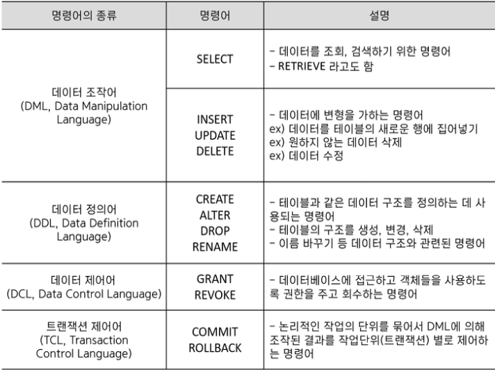
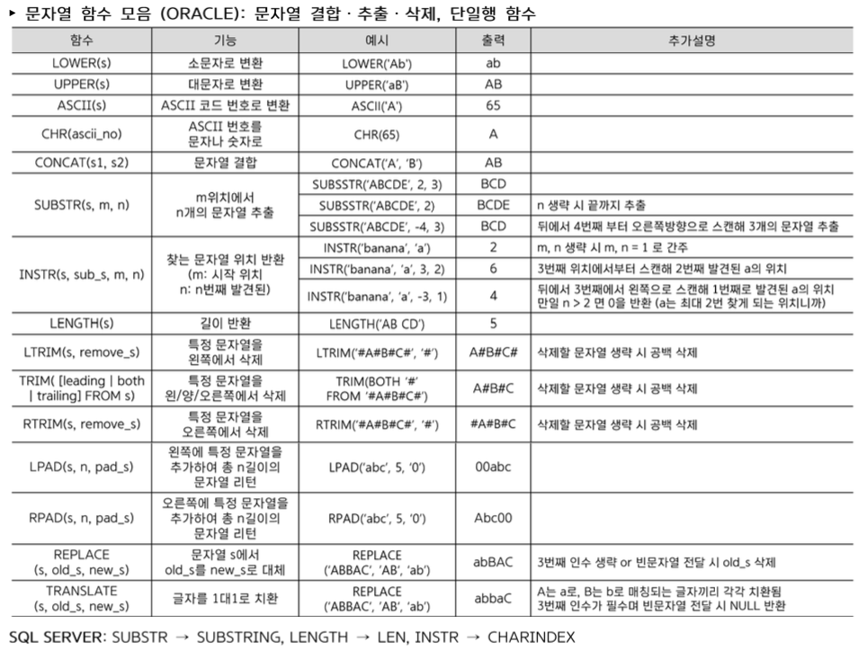
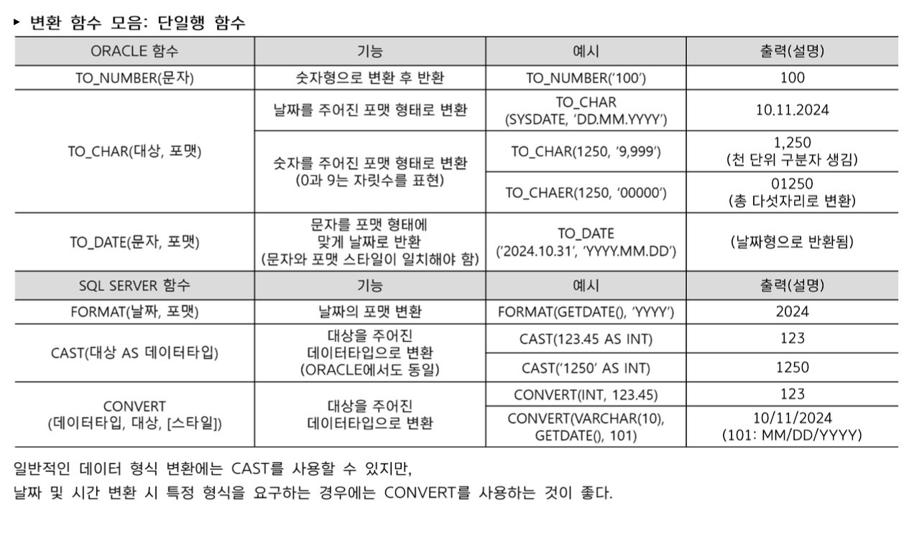
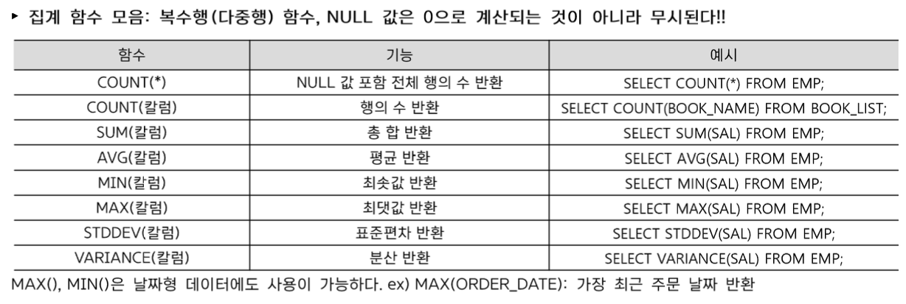
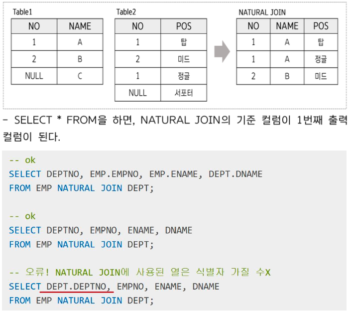
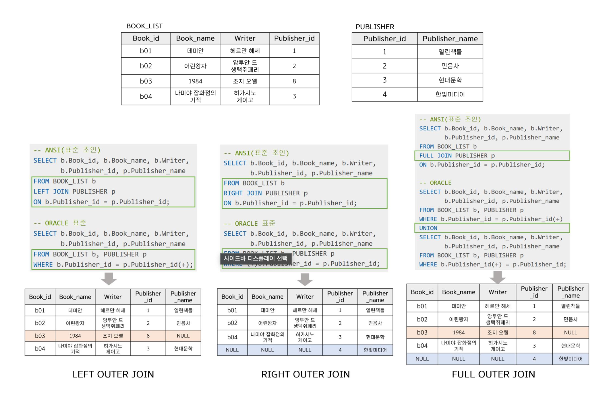

# SQL 기본

# 1절 관계형 데이터 베이스 개요

## 7. 테이블 특징
- 하나의 테이블은 반드시 하나의 User가 소유해야한다.
- 테이블간 관계  1:1, 1:N, N:N
- 테이블명은 중복될 수 없으니 소유자가 다르다면 같은 이름으로 생성될 수 있다.
- 같은 계정으로 동일한 이름을 가진 객체 생성 불가
- 테이블은 행 단위로 데이터가 입력, 삭제 되며 수정은 값의 단위로 가능하다.

## SQL 실행 단계
1. Parsing
2. Execution
3. Fetch

## 4대 제약 조건
1. 도메인 제약
- 속성에 대한 제약
2. 키 제약
릴레이션, 테이블은 반드시 PK를 가져야한다.
3. 개체 무결성 제약
PK는 UNIQUE하면서 NOT NULL 이어야 한다.
4. 참조 무결성 제약
- 외래 키에 대한 제약

# 2절 SELECT 문
### 1. SQL 문장들의 종류 


> DML: 사용자가 Commit 해야한다. -> Rollback 가능
> DDL: AUTO COMMIT ROLLBACK 불가

### 2. SQL문 실행 순서

> FROM -> WHERE -> GROUP BY -> HAVING -> SELECT -> ORDER BY

### 3. SELECT 절 
- SELECT 문장을 사용하여 불러올 컬럼 명, 연산 결과를 작성하는 절

### 4. AS
SQL에서 별칭을 만들 때 사용하는 키워드
- 별칭을 통해 출력할 컬럼이나 테이블에 임시로 이름을 부여할 수 있디.

### 5. AS의 특징 및 주의사항
- SELECT 문보다 늦게 사용되는 ORDER BY절에서만 컬럼 별칭 사용
- HAVING 이나 WHERE절에서 사용하면 에러 발생 (SQL 실행순서가 select 이전이기 때문에)
- 오라클에서는 사용할 수 없음

### 6. ALL/ DISTINCT
- DISTICT: 중복된 데이터가 있는 경우 1건으로 처리해서 출력

### 7. FROM 절 
- 데이터를 불러올 테이블명이나 뷰명 전달
- 여러 테이블 전달 가능
- 여러 테이블 사이에 JOIN 조건이 존재하지 않는다면 SQL은 두 테이블의 모든 가능한 조합을 생성(cartesian product) 
- ORACLE은 AS 불
- 테이블에 별칭을 사용시, 해당 테이블을 참조할 때 반드시 별칭을 사용해야한다.
- ORALCE에서는 FROM절 생략 불가 

### 8. SQL문 작성시 주의사항
- 문자 상수나 날짜 상수 표현시 홑따옴표 사용
- ORACLE은 문자 상수의 경우 대소문자 구분
- mysql은 대소문자 구분 x

# 제 3절 함수
### 1. 함수란?
- 단일행 함수:
하나의 입력 값에 대해 하나의 결과를 반환하는 함수(1:1) 
    - 각 행들에 대해 개별적으로 작용하여 데이터 값들을 조작하고 각각의 행에 대한 조작 결과를 반환함
    - SELECT WHERE ORDER BY 절에서 사용된다. 

- 복수행 함수
    - 여러 행의 데이터를 하나의 결괏값으로 반환하는 함수
    - 주로 합계, 평균, 개수, 최대/최소 값을 계산하는데 사용
    - SELECT HAVING ORDER BY 절에서 사용 가능 








- CASE의 표현
ORACLE의 DECODE()와 일치
- 
```SQL
SELECT 
    CASE col
        WHEN 'A' THEN 'B'
        WHEN 'C' THEN 'D'
        ELSE 'E'
    END / END AS
```

# 4절 WHERE 문

### 1. 특징
- 테이블의 데이터 중 원하는 조건에 맞는 데이터만 조회하고 싶을 때 사용
- 즉 조건을 설정하여 원하는 데이터만 검색하기 위해 사용하는 절
- NULL은 '='로 조회 불가, IS NULL / IS NOT NULL 사용
- 집계함수 사용 불가

### 2. WHERE 절 구문

```sql
SELECT [DISTINCT/ALL] 칼럼명 [ALIAS]
FROM table
WHERE condition
```

### 3. 주의
- 집계함수는 WHERE 절에서 사용이 불가능 하다.
- WHERE 절은 각 행을 개별적으로 필터링 하기 떄문에 여러 행의 데이터를 요약하여 하나의 결과를 생성하는 집계함수의 사용이 불가능한 것
- GROUP BY 를 통해 그룹화된 결과에 대한 조건을 적용할 때, 집계 함수를 조건절에 사용할 수 있게 된다.

### 4. WHERE과 논리 연산자
우선순위가 더 높은 AND 연산자가 OR 연산자보다 우선적으로 실행된다.

### 5. WHERE과 IN
- 특정 컬럼의 값이 지정된 목록 중에서 일치하는 값이 있는지 확인
- OR을 사용해 표현이 가능하지만, IN을 사용하면 쿼리가 훨씬 간결해짐
- IN은 NULL값을 무시

### 6. WHERE과 BETWEEN A AND B 
- A보다 크거나 같고 B 보다 작거나 같은 조건을 만족 

### 7. WHERE 과 LIKE
- LIKE연산자는 대소문자를 구별한다.
> 와일드 카드
> %: 0개의 문자를 대체 = 해당 위치에 몇 글자던 올 수 있다.
> _: 딱 1개의 문자만을 대체 = 해당 위치에 반드시 한 글자만 올 수 있다.

### 8. WHERE 과 IS NULL 
- NULL값과의 수치 연산은 NULL을 return
- NULL값과의 비교 연산은 거짓을 return

# 5절 GROUP BY 와 HAVING 절
### 1. GROUP BY 절
- 데이터들을 작은 그룹으로 분류하여 소그룹에 대한 항목별 통계 정보를 얻을 때 사용한다.
- GROUP관련 조건들은 WHERE에서 사용할 수 없고 HAVING에서만 사용할 수 있다.
- 별칭을 사용할 수 없다.
- 성능 저하를 막기 위해 그룹 연산에서 필요가 없는 데이터는 미리 WHERE 절을 통해 제외해두어야한다.
### 2. 주의할 점
- GROUP BY로 그룹화를 한 이후에는 그룹화 기준이 아닌 컬럼을 SELECT 절에 사용할 수 없다.
- 그룹화되지 않은 칼럼을 이용하고 싶다면 집계 함수를 통해 각 그룹에서 해당 칼럼을 요약해야한다.

### 3. HAVING 절 
- 그룹화된 결과에 대한 조건을 적용할 때 사용하는 절
- HAVING 절이 GROUP BY 절 앞에 위치해도 되나, 논리적인 실행순서에 맞게 GROUP BY 뒤에 쓰는 것을 권장한다.
- SELECT 절에서 선언된 ALIAS 사용 불가

# 6절 ORDER BY 절 
- 원칙적으로 데이터베이스 시스템에서는 ORDER BY 절을 명시해야만 정렬이 수행된다.
- ORDER BY 뒤에 정렬의 기준이 되는 컬럼을 명시하면 된다.
- 정렬 순서 ASC, DESC 
- 유일하게 SELECT 절에 정의한 컬럼 별칭을 사용할 수 있다.
- ORACLE에서 NULL은 최댓값, SQL에서는 최솟값
- GROUP BY로 그룹화를 했을 시 ORDER BY에 올 수 있는 컬럼은 SELECT 절에 있는 컬럼만 가능하다.

# 7절 JOIN
### 1. 조인
- 여러 테이블의 데이터를 동시에 출력하거나 참조할 때 사용한다.
- 일반적인 경우 행들은 PK, FK의 값 연관에 의해 조인이 성립된다.
- FROM 절에 여러 테이블이 나열되더라도 SQL에서 데이터를 처리할 때는 단 2개의 집합 간에만 조인이 일어난다.
- 여러 테이블 조인시 SELECT 절에 적는 컬럼은 해당 컬럼이 어느 테이블에 존재하는 컬럼인지를 명시해야한다.
- N개의 테이블 조인시 최소 N-1개의 조인 조건 필요

### 2. 조인의 종류 

#### 조건의 형태에 따른 분류
1. 동등 조인
조인 조건이 동등 조건인 경우
2. 비동등 조인
조인 조건이 동등 조건이 아닌 경우

#### 조인 결과에 따른 분류
1. INNER JOIN
2. OUTER JOIN
3. NATURAL JOIN
4. CROSS JOIN(Cartesian Product)
5. SELF JOIN


### 2. EQUI JOIN(동등 조인)


- 등등 조인은 2개의 테이블 간에 컬럼 값들이 서로 정확하게 일정하게 일치하는 경우에 사용되는 조인 방법이다.

#### ANSI/ISO SQL
```sql
SELECT t1.c, t2.c
FROM t1, t2
INNER JOIN t2
ON t1.c = t2.c
```
#### ORACLE
```sql
SELECT t1.c, t2.c
FROM t1, t2
WHERE t1.c = t2.c
```

데이터 필터링 조건도 WHERE 절에 추가해주면 된다.

만약 테이블에 대한 ALIAS를 적용했을 경우, 다른 SELECT, HWERE 등의 절에서도 본래 테이블명이 아닌 ALIAS를 사용해야만 한다.

### 3.비등동 조인
- 비동등 조인은 2개의 테이블 간에 컬럼 값들이 서로 정확하게 일치하지 않는 경우에 사용하는 조인 방식이다.
- 즉 "=" 연산자가 아닌 다른 (BETWEEN, < , <=, >, >=) 연산자들을 사용하여 조인을 수행한다.

#### ANS/SIO SQL
```sql
SELETCT t1.c, t2.c
FROM t1, t2
WHERE t1.c BETWEEN t2.c AND t2.c
```

### 4. 3개 이상의 테이블 조인


### 5. SELF JOIN 

- 동일 테이블 사이의 조인
- FROM 절에서 동일 테이블이 2번 이상 나타나게 되니 식별을 위해 반드시 테이블 ALIAS를 사용해야 한다.

- JOIN 조건이 일치하지 않는 데이터들도 출력하고 싶을떈 OUTER JOIN을 사용해야한다.

# 8절 표준 조인
- ANSI 표준으로 작성되는 INNER/CROSS/NATURAL/OUTER JOIN

### 3. INNER JOIN 
- 내부 JOIN이라고 하며 JOIN 조건이 일치하는 행만 반환
- ORACLE JOIN의 기본
- ANSI 표준에서는 USING 조건절이나 ON 조건절이 필수


### 4. ON 조건절
- 조인할 양 컬럼의 컬럼명이 서로 달라도 사용 가능
- 같은 컬럼명을 가진 테이블과 조인시 테이블 출처 명확하게
- ANSI: ON 조건절 JOIN 조건 명시, WHERE 조건절 일반 조건 명시

### 5. USING 조건절
- 조인할 양 컬럼의 컬럼명이 같을 경우 사용
- ALIAS 사용 불가, 출처 테이블 명시 불가
- USING 절의 기준 컬럼은 식별자를 가질 수 X
- SQL Server에서는 지원하지 않는다.


### 6. NATURAL JOIN

- 두 테이블 간의 동일한 이름을 갖는 모든 컬럼들에 대해 동등 JOIN을 수행한다.
- JOIN에 사용되는 칼럼들은 동일한 이름, 같은 타입, 도메인 이어야한다.
- NATURAL이 명시되면 USING, ON, WHERE절에서 조건을 정의할 수 없다.
- JOIN에 사용된 컬럼들은 ALIAS나 테이블명으로 사용할 수 없다.
- 여러 개의 컬럼명이 동일한 경우, 동일한 이름을 가진 모든 컬럼의 값이 같아야 JOIN 된다.
- NATURAL JOIN은 JOIN에 사용된 같은 이름의 칼럼을 하나로 처리.

### 7. CROSS JOIN
- 조인 조건을 명시하지 않는다면 Cartesian Product 출력
- m개와 n개의 개수를 가지고있는 테이블이 있다면 CROSS JOIN했을때는 m * n개의 결과 출력
- CROSS JOIN은 NATURAL JOI과 다르게 조건을 추가할 수 있지만 추가하면 INNER JOIN과 같은 결과가 나오므로 사용 지양

### 8. OUTER JOIN
#### LEFT OUTER JOIN
- 왼쪽 테이블을 기준으로 오른쪽 테이블이 더해지는 형태
- 즉 왼쪽 테이블의 모든 행이 반환되며 오른쪽 테이블에서는 왼쪽 테이블의 결합 기준 칼럼에 일치하는 값만 반환 없으면 NULL로 채워짐

#### RIGHT OUTER JOIN
- 오른쪽 테이블을 기준으로 왼쪽 테이블이 더해지는 형태
- 즉 오른쪽 테이블의 모든 행이 반환되며 왼쪽 테이블에서는 오른쪽 테이블의 결합 기준 칼럼에 일치하는 값만 반환 없으면 NULL로 채워짐

#### FULL OUTER JOIN
- 두 테이블의 모든 데이터가 결합되는 조인 방식
- ORACLE에서는 직접적으로 지원하지 안지만 UNION으로 유사하게 구현 가능

ORACLE과 MYSQL의 작성 방식이 다르다.



